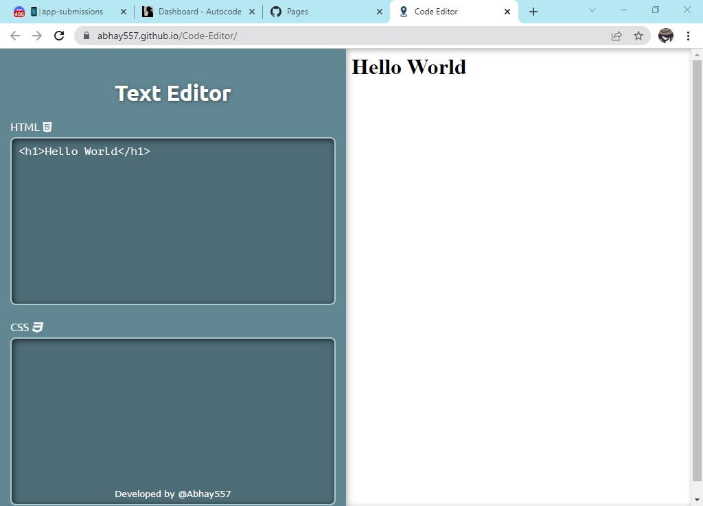

# Code 557

This Code 557 is a free and open-source online code editor that allows you to write and execute code of Html Css Java Script.
It's perfect for anybody who just wants to quickly write and run some code without opening a Applicaton, Its Web Based Editor.

## Preview

## Community
Do you have a question, feature request or something else on your mind?
Or you just want to follow  news?
Check out these links:

* [Support](https://autocode.com)
* [Join a Discord server](https://discord.gg/5V68EK8AeS)
* [Report An Issue](https://github.com/Abhay557/Code-Editor/issues/new)
* [Contact The Author](https://github.com/Abhay557)
